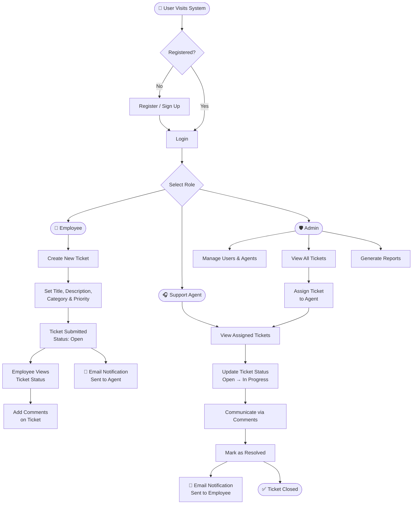

<p align="center"><a href="https://laravel.com" target="_blank"></a></p>

<p align="center">
<a href="https://github.com/Jyoti0174/Internship-Backend/actions"></a>
<a href="https://packagist.org/packages/laravel/framework"></a>
<a href="https://packagist.org/packages/laravel/framework"></a>
<a href="https://packagist.org/packages/laravel/framework"></a>
</p>

## About This Project

The **Employee Helpdesk & Ticket Management System** is a Laravel 11 backend application built with PHP. It provides a structured platform where employees can raise support tickets and track their resolution, while agents and admins manage the entire support workflow.

This project was developed as part of an internship assignment, demonstrating real-world backend development skills including MVC architecture, RESTful API design, database migrations, role-based authentication, and clean code practices.

**What this system does:**

- Employees can register, login, and raise support tickets
- Support Agents can view, assign, and update ticket status
- Admins have full control — manage users, agents, categories, and reports
- Every ticket goes through a defined lifecycle: `Open → In Progress → Resolved → Closed`
- Priority levels (`Low`, `Medium`, `High`, `Critical`) ensure urgent issues are handled first
- Department-wise categorization (IT, HR, Admin, Finance, etc.)
- Commenting system for back-and-forth communication on tickets
- Email notifications triggered on ticket creation, assignment, and resolution

**Tech Stack:**

| Layer | Technology |
|---|---|
| Language | PHP 8.2+ |
| Framework | Laravel 11 |
| Database | PostgreSQL 14+ |
| ORM | Eloquent |
| Auth | Laravel Sanctum |
| API | RESTful JSON API |
| Views | Blade Templates |
| Testing | PHPUnit / Pest |

**Project Structure:**
internship-backend/

├── app/

│   ├── Http/

│   │   ├── Controllers/     # Ticket, User, Auth, Agent controllers

│   │   ├── Middleware/      # Role-based access, Auth checks

│   │   └── Requests/        # Form validation rules

│   ├── Models/              # User, Ticket, Comment, Category models

│   └── Services/            # Business logic layer

├── database/

│   ├── migrations/          # All table schema definitions

│   └── seeders/             # Default roles, users, categories

├── resources/views/

│   └── tickets/             # Blade views (create, edit, index, show)

├── routes/

│   ├── api.php              # All REST API routes

│   └── web.php              # Web routes

├── tests/                   # Feature and unit tests

├── .env.example

├── composer.json

└── README.md

---

## Software Prerequisites

| Software | Minimum Version | Download |
|---|---|---|
| PHP | v8.2+ | https://www.php.net/downloads |
| Composer | v2.x+ | https://getcomposer.org/ |
| PostgreSQL | v14.x+ | https://www.postgresql.org/download/ |
| Git | v2.x+ | https://git-scm.com/ |

Verify your installations:
```bash
php -v
composer -V
psql --version
git --version
```

---

## PostgreSQL Setup

**1. Start PostgreSQL Service**

macOS:
```bash
brew services start postgresql@14
```

Ubuntu/Debian:
```bash
sudo systemctl start postgresql
sudo systemctl enable postgresql
```

Windows: Open `services.msc` → start `postgresql-x64-14`

**2. Open PostgreSQL Shell**
```bash
psql -U postgres
```

**3. Create Database and User**
```sql
CREATE USER helpdesk_user WITH PASSWORD 'your_secure_password';

CREATE DATABASE helpdesk_dev OWNER helpdesk_user;
CREATE DATABASE helpdesk_test OWNER helpdesk_user;

GRANT ALL PRIVILEGES ON DATABASE helpdesk_dev TO helpdesk_user;
GRANT ALL PRIVILEGES ON DATABASE helpdesk_test TO helpdesk_user;

\q
```

**4. Verify Connection**
```bash
psql -U helpdesk_user -d helpdesk_dev -h localhost
```

---

## Environment Configuration

**1. Copy the example env file**
```bash
cp .env.example .env
```

**2. Update `.env` with your local values**
```env
APP_NAME="Employee Helpdesk System"
APP_ENV=local
APP_KEY=
APP_DEBUG=true
APP_URL=http://localhost:8000

DB_CONNECTION=pgsql
DB_HOST=127.0.0.1
DB_PORT=5432
DB_DATABASE=helpdesk_dev
DB_USERNAME=helpdesk_user
DB_PASSWORD=your_secure_password

MAIL_MAILER=smtp
MAIL_HOST=smtp.mailtrap.io
MAIL_PORT=587
MAIL_USERNAME=your_mailtrap_user
MAIL_PASSWORD=your_mailtrap_password
MAIL_ENCRYPTION=tls
MAIL_FROM_ADDRESS=helpdesk@yourcompany.com
MAIL_FROM_NAME="${APP_NAME}"

CACHE_DRIVER=file
QUEUE_CONNECTION=sync
SESSION_DRIVER=file
```

**3. Generate Application Key**
```bash
php artisan key:generate
```

> ⚠️ Never commit your `.env` file — it is already listed in `.gitignore`.

---

## Installation Steps

**1. Clone the repository**
```bash
git clone https://github.com/Jyoti0174/Internship-Backend.git
cd Internship-Backend
```

**2. Install dependencies**
```bash
composer install
```

**3. Configure environment**
```bash
cp .env.example .env
php artisan key:generate
```

---

## Migration Commands

Run all pending migrations:
```bash
php artisan migrate
```

Fresh migration (drops all tables and re-runs):
```bash
php artisan migrate:fresh
```

Rollback last migration batch:
```bash
php artisan migrate:rollback
```

Rollback all migrations:
```bash
php artisan migrate:reset
```

Check migration status:
```bash
php artisan migrate:status
```

Create a new migration:
```bash
php artisan make:migration add_priority_to_tickets_table
```

---

## Seeder Commands

Run all seeders:
```bash
php artisan db:seed
```

Run a specific seeder:
```bash
php artisan db:seed --class=UserSeeder
php artisan db:seed --class=TicketSeeder
```

Fresh migration + seed together:
```bash
php artisan migrate:fresh --seed
```

Create a new seeder:
```bash
php artisan make:seeder TicketSeeder
```

**Default Seeded Accounts (Development Only):**

| Role | Email | Password |
|---|---|---|
| Admin | admin@helpdesk.local | Admin@1234 |
| Agent | agent@helpdesk.local | Agent@1234 |
| Employee | employee@helpdesk.local | Employee@1234 |

> ⚠️ Change all default passwords before deploying to any non-development environment.

---

## Running the Application Locally

Start the development server:
```bash
php artisan serve
```

API available at: **http://localhost:8000**

Run tests:
```bash
php artisan test
php artisan test --coverage
php artisan test --filter=TicketTest
```

Clear all caches:
```bash
php artisan optimize:clear
```

### ✅ Quick Start

```bash
git clone https://github.com/Jyoti0174/Internship-Backend.git
cd Internship-Backend
composer install
cp .env.example .env
php artisan key:generate
# Edit .env with your DB credentials
php artisan migrate:fresh --seed
php artisan serve
```

---

## Contributing

Thank you for considering contributing to this project! Please review and abide by the [Code of Conduct](https://laravel.com/docs/contributions#code-of-conduct).

## Security Vulnerabilities

If you discover a security vulnerability, please send an e-mail to the project maintainer. All security vulnerabilities will be promptly addressed.

## License

This project is open-sourced software licensed under the [MIT license](https://opensource.org/licenses/MIT).

Step 3 — Terminal mein push karo:
bashgit add README.md
git commit -m "docs: add complete project README with helpdesk overview"
git push origin main
Iske baad GitHub pe refresh karo — Laravel logo + badges + poora project overview dikh jayega! 🚀You said: i also want to add flow chart how can i add it in my readmei also want to add flow chart how can i add it in my readme11:55 AMClaude responded: Aap README mein flowchart add kar sakte ho Mermaid se — GitHub directly Mermaid diagrams render karta hai, koi image ki zarurat nahi!Aap README mein flowchart add kar sakte ho Mermaid se — GitHub directly Mermaid diagrams render karta hai, koi image ki zarurat nahi!
Apni README.md mein ye section add karo jahan chahiye:

markdown## 🔄 System Flowchart



GitHub pe push karo:
bashgit add README.md
git commit -m "docs: add system flowchart using mermaid"
git push origin main
GitHub pe ye automatically render hoga aise:
User → Login → Role Check
                ├── Employee  → Create Ticket → Notifications
                ├── Agent     → Manage Tickets → Resolve
                └── Admin     → Full Control → Reports
